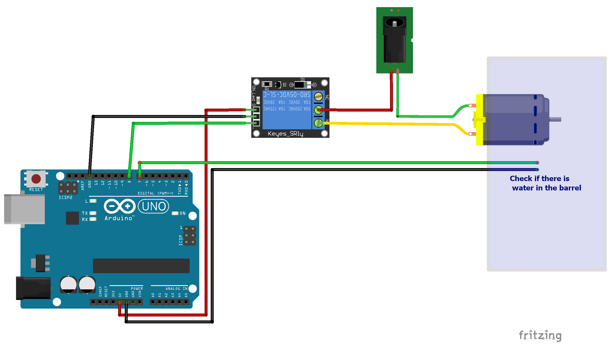

# arduino-watering-system
This sketch will pump water twice a day. A sensor detects wheter there is water in the barrel. Arduino will not start the pump, when the barrel is empty.

# Circuit
Connect the arduino like in the following circuit diagram.

